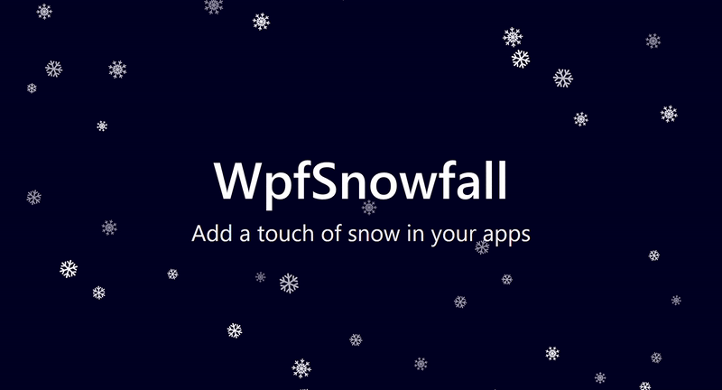



<h1 align="center">WpfSnowfall</h1>
<p align="center">
 Add a touch of snow in your apps with this fully customizable snowfall control.
</p>
<p align="center">
 Based on <a href="https://github.com/tsasioglu/Wpf-Snow">Wpf-Snow</a>
</p>
<br>

<p align="center">
  <a href="https://github.com/marplex/WpfSnowfall/blob/main/LICENSE"></a>
  <a href="https://www.nuget.org/packages/WpfSnowfall/"></a>
  <a href="https://www.nuget.org/packages/WpfSnowfall/"></a>
  <a href="https://github.com/Marplex"></a> 
</p>


# Features

- [x] Multiple types of snowflake
- [x] Fully customizable

# Available for

<br/>
<br/>
<br/>

# How to use

Include WpfSnowfall user control in your layout. For more info view the `Demo` project.

```xml
<sf:Snowfall
    EmissionRate="5"
    Fill="White"
    ScaleFactor="1.1"
    OpacityFactor="1"
    ParticleSpeed="1" />
```

## Customize

| Property      	| Description                                                        	| Default 	|
|---------------	|--------------------------------------------------------------------	|---------	|
| EmissionRate  	| How many snowflakes to emit every second                           	| 5       	|
| ScaleFactor   	| Scale in/out snowflakes. Higher values generates bigger snowflakes 	| 1.0     	|
| OpacityFactor 	| Snowflake opacity                                                  	| 1.0     	|
| ParticleSpeed 	| Snowflake fall speed                                               	| 1.0     	|
| Fill          	| Snowflake color                                                    	| White   	|


# 📜 License

```xml
Copyright (c) 2023 Marco

Permission is hereby granted, free of charge, to any person obtaining a copy
of this software and associated documentation files (the "Software"), to deal
in the Software without restriction, including without limitation the rights
to use, copy, modify, merge, publish, distribute, sublicense, and/or sell
copies of the Software, and to permit persons to whom the Software is
furnished to do so, subject to the following conditions:

The above copyright notice and this permission notice shall be included in all
copies or substantial portions of the Software.

THE SOFTWARE IS PROVIDED "AS IS", WITHOUT WARRANTY OF ANY KIND, EXPRESS OR
IMPLIED, INCLUDING BUT NOT LIMITED TO THE WARRANTIES OF MERCHANTABILITY,
FITNESS FOR A PARTICULAR PURPOSE AND NONINFRINGEMENT. IN NO EVENT SHALL THE
AUTHORS OR COPYRIGHT HOLDERS BE LIABLE FOR ANY CLAIM, DAMAGES OR OTHER
LIABILITY, WHETHER IN AN ACTION OF CONTRACT, TORT OR OTHERWISE, ARISING FROM,
OUT OF OR IN CONNECTION WITH THE SOFTWARE OR THE USE OR OTHER DEALINGS IN THE
SOFTWARE.
```